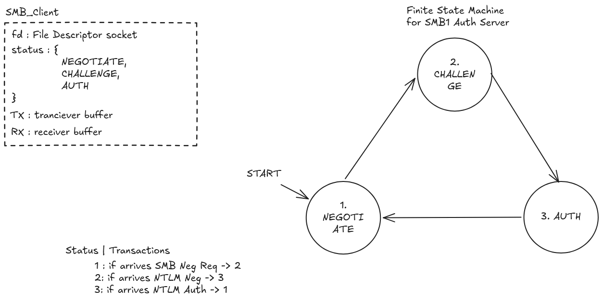
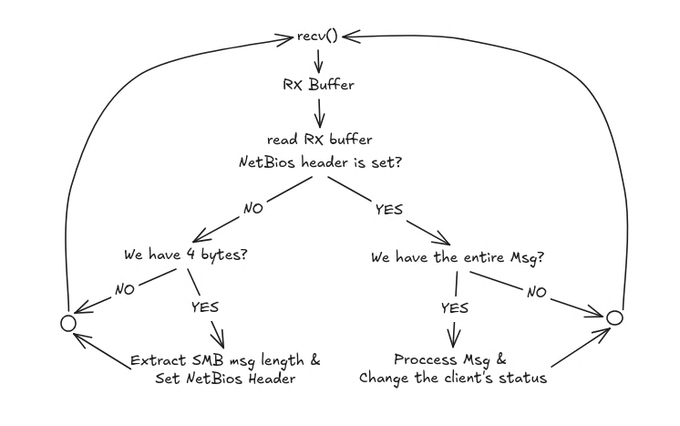

# SMB Server Implementation IDEA

SMB1 server per l'intercettazione di Hash NTLMv2.
L'obiettivo è implementare il server come macchina a stati per accettare e rispondere correttamente al client per ingannarlo. 
Idea per macchina a stati:



Quindi ad alto livello:


| Stato |Transizioni|
|-------|-----------|
| 1. `NEGOTIATE` | Se arriva un `SMB NEGOTIATE` allora in seguito alla risposta del server lo stato deve passare a `2.CHALLENGE` |
| 2. `CHALLENGE` | Se arriva un `NTLM_NEGOTIATE` allora in seguito alla risposta del server lo stato deve passare a `3.AUTH` |
| 3. `AUTH` | Se arriva un `NTLM_AUTH` allora in seguito alla risposta del server lo stato deve passare a `1.NEGOTIATE` |

A livello implementativo c'è da tenere in considerazione la "busta" esterna NetBios, che è formata da 4 byte ed, gli ultimi 3 byte, indicano la lunghezza in byte del pacchetto SMB. 

Una possibile struttura per memorizzare lo stato dei client è la seguente:

```C
typedef enum {
    NEGOTIATE,
    CHALLENGE,
    AUTH
} client_status_t;

typedef struct client {
    int fd;
    
    client_status_t status;

    int netbios_header_recv;
    size_t netbios_msg_len;

    /*
     * RX:
     *
     * Dati ricevuti dal socket ma non ancora
     * completamente processati.
     */
    unsigned char rx_buf[RX_SIZE];
    size_t rx_len;

    /*
     * TX:
     *
     * Dati che vogliamo mandare al client
     * ma che non sono ancora stati completamente
     * inviati.
     */
    unsigned char tx_buf[TX_SIZE];
    size_t tx_len;
    size_t tx_off;

} client_t;
```
Quindi l'idea è che alla ricezione di dati da parte del client si vada a verificare che almeno **4 byte** siano stati ricevuti correttamente, si procede a determinare la lunghezza del messaggio, si aggiornano i campi `netbios_header_recv` e `netbios_msg_len`, poi si processa il messaggio cambiando lo stato del client (`status`) in modo che sia correttamente impostato per prossima ricezione.

I buffer `RX` e `TX` servono per la ricezione ed invio dei dati attraverso tecniche di buffering per evitare che il server si blocchi nell'invio o ricezione. In questo modo processerà solo se ci sono effettivamente dati.

Idea per la ricezione nel main loop:

